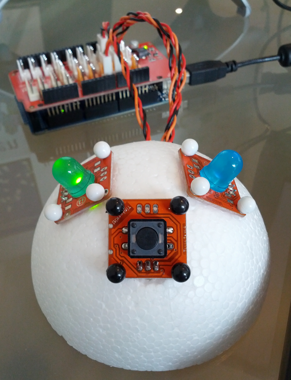

## Pomoduino

Super simple pomodoro timer built with Arduino.

These sketches are based on a TinkerKit shield with LEDs on O2 and O3. The push button for starting a pomodoro is on I2. One version of the sketch uses the [TinketKit library](http://tinkerkit.com/en/Tutorials/Home). The other version has no dependencies.

Apache License, Version 2.0.